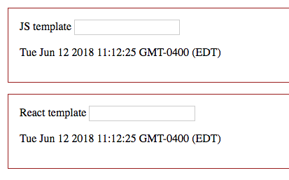

# A Practical Start with React

> My notes from [this Pluralsight course](https://app.pluralsight.com/library/courses/react-practical-start/table-of-contents).

## Should You React?

### Smart DOM Updates

[Markup](smart-dom-updates/index.html) | [Script](smart-dom-updates/script.js)

Comparing plain js and react for updating DOM.

The react method of creating a DOM element and rendering it looks more complicated than the plain js version, however, notice the DOM updates - plain js version is updating the entire div whereas react version only updates what's changing (the date in this example), even though the code tells react to update the entire div. This makes it impossible to type in text in the plain version, but can do in react:




### The React Element Tree

React does not use HTML directly, rather it uses a tree of JavaScript objects to define UI, where each is created via `React.createElement`:

```html
<div class="split">
  <input />
  <p>Sunday 4:00pm</p>
</div>
```

```javascript
Rreact.createElement(
  'div',
  { className: 'split' },
  React.createElement('input'),
  React.createElement(
    'p',
    null,
    'Sunday 4:00pm'
  )
);
```

The tree is used to create HTML for browser. This means UI is written in js instead of html...

### Separation of Concerns

react-dom library (containing everything needed for browser support, including object tree transformation) is intentionally separate from core react engine. Benefit is open ended, eg: react-native renders an object tree to mobile controls for different mobile platforms.

Object tree is not the UI, it's instructions for how UI should be rendered. React passes tree to DOM library for rendering.

Philosophy: What's displayed in the browser is a reflection of the state of the application.

### Tree Reconciliation

In simple demo, object tree changes every second due to date change, eg:

```javascript
React.createElement(
  'div',
  { className: 'split' },
  React.createElement('input'),
  React.createElement(
    'p',
    null,
    'Sunday 4:01pm' // only this changed
  )
);
```

Every time a change occurs, a new object tree is created, but old one is kept. React compares the new to old object trees and only redraws elements where a change was detected. In above example, its the `<p>` element containing the date string. Then the old tree is disposed of.

However, creating every DOM element with `createElement` API is tedious, this is where JSX comes in.

### JSX

Seems like HTML but is actually js. Notice `className` instead of `class` for css:

```jsx
<div className="split">
  <input />
  <p>
    Sunday 4:01 pm
  </p>
</div>
```

JSX syntax is translated to `React.createElement(...)` syntax by Babel.

### The React UI Workflow

- Write JSX to define UI
- JSX translated to JS with React.createElement statements using Babel
- Each time app needs to be renderd to browser, react-dom uses react elements to generate actual DOM, but only updated elements are rendered.


### Components

Philosophy: React is a JavaScript library to create and compose components.

Each component has the following:

1. A name.
1. Accepts inputs from other components using `props`. In jsx, these are written as html attributes.
1. Can maintain an internal `state`.
1. Knows how to render itself by calling `render()` function. This process may involve other components.

App will be building in this course - note components such as header, search, featured house:


**Composition**

React app is a composition of components. Typically top level component is named `app`. App renders other components, eg: Header, FeaturedHouse, SearchResults. Each component can further render other components, eg: FeaturedHouse will render HouseDetail.


Each component maintains its own internal state, and can pass input to its child components using `props`.

### Alternatives to React

Angular and Vue are most popular other choices. All are good products, choice depends on personal preference or that of your team.

If don't like the fact that UI is written in JS, and prefer to write in separate html file, consider Angular.


Note: Writing HTML in JS may feel strange at first, but Angular and Vue write JS expressions in HTML which is also weird, and more difficult to debug.
